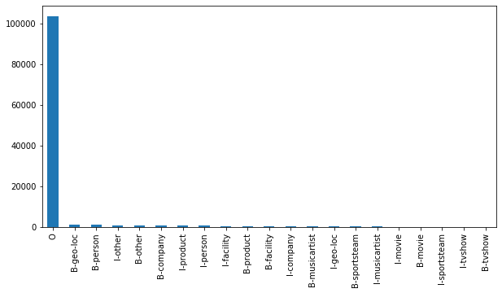
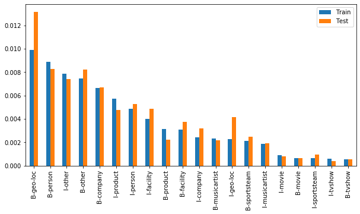
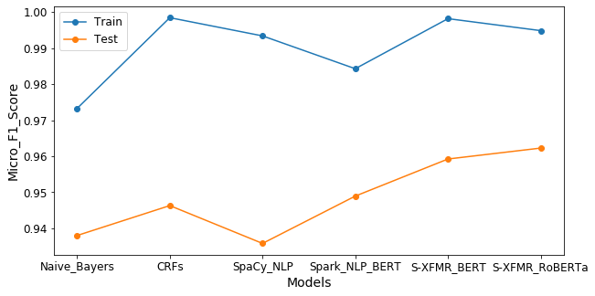
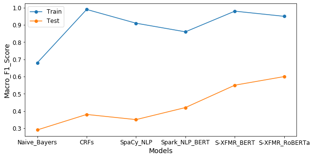
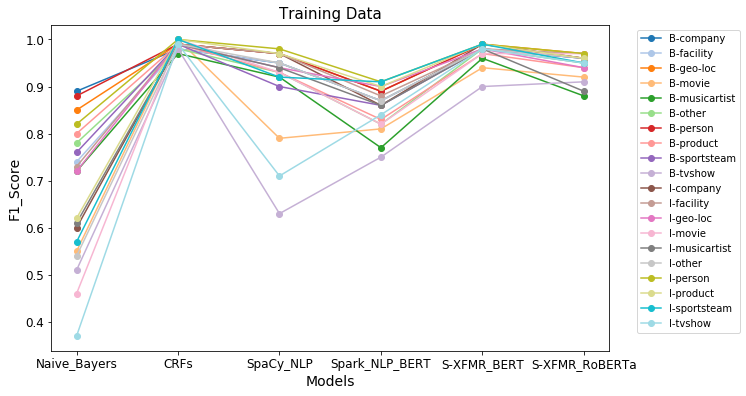
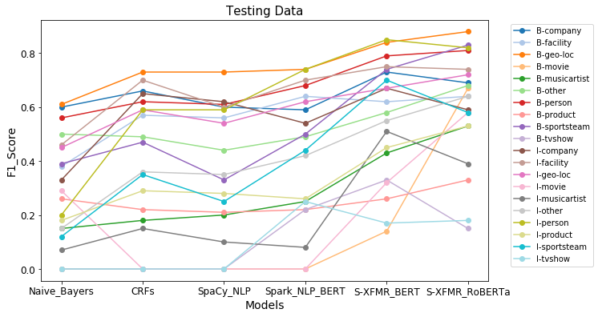
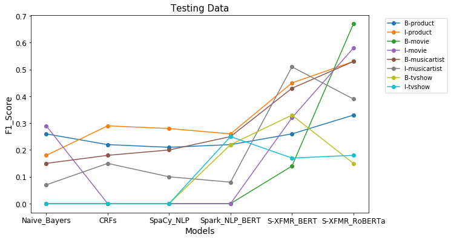

# Named Entity Recognition(NER) on Twitter 

In these notewooks, I will use 5 ways to solve custom Named Entity Recognition (NER) problem on Twitter. NER is a task that seeks to locate and classify named entities mentioned in unstructured text into pre-defined categories such as person names, organizations, locations, medical codes, time expressions, quantities, monetary values, percentages, etc.

In this dataset, we have 21 different tags for sentences.

tags = ['O', 'B-musicartist', 'I-musicartist', 'B-product', 'I-product', 'B-company', 'B-person', 'B-other', 'I-other', 'B-facility',
    'I-facility', 'B-sportsteam', 'B-geo-loc', 'I-geo-loc', 'I-company', 'I-person', 'B-movie', 'I-movie', 'B-tvshow', 'I-tvshow',
    'I-sportsteam'],

where 'B-' and 'I-' prefixes stand for the beginning and inside of the entity, 'O' stands for out of tag or no tag.

### Models

In the following three notebooks, we will use five ways to examine the dataset:

- Naive Bayes multinomial model(NER-1.ipynb)
- Conditional Random Fields (CRFs)(NER-1.ipynb)
- Custom SpaCy(NER-1.ipynb)
- BERT in Spark NLP(embedding with BERT)(NER-2.ipynb)
- Simple Transformer(pretrained models BERT and RoBERTa)(NER-3.ipynb) 

### Dataset

The number of text entities in train dataset is 6519, in test dataset is 724. The train dataset is highly imbalanced. The number of the tag "O" is 1670 times of that of the tag "B-tvshow". Below is the statistical number of the 21 classes in the train dataset:

<pre>
O                103577
B-geo-loc          1109
B-person            998
I-other             880
B-other             838
B-company           747
I-product           641
I-person            544
I-facility          449
B-product           352
B-facility          348
I-company           271
B-musicartist       260
I-geo-loc           258
B-sportsteam        237
I-musicartist       212
I-movie              99
B-movie              75
I-sportsteam         72
I-tvshow             66
B-tvshow             62
</pre>

Probability distribution of tags(remove "O") in train and test dataset, The probability of every tag in this figure is smaller than 1.4%:

### F1-Score

Below is the figure of micro F1-score of the five models. We can see that there is an obvious leap of test dataset's F1-score for model "simpletransformers":

Below is figure of macro F1-score of the five models(remove over-represented label "O"). The F1-score increases 13% from model "Spark-NLP" to "simpletransformers". From model "simpletransformers-BERT" to "simpletransformers-BERT" it increases 5%:

F1-score for all the tags, except tag "O":

F1-score of poorly classified tags 'B-product', 'I-product', 'B-movie', 'I-movie', "B-musicartist", "I-musicartist", 'B-tvshow', 'I-tvshow':

The probabilites of these tags in traindataset is smaller than 0.6%, in testdataset is smaller than 0.5%. In average there is a leap for model "simpletransformer".

The training time for models "Naive_Bayers", "CRFs", "SpaCy_NLP" are around 20min(without gpu), for models "Spark_NLP_BERT", "Simpletransformers_BERT", "Simpletransformers_RoBERTa" are around 1h(with one gpu in google colab).

### Conclusion

Despite the Twitter NER dataset is small and high imbalanced, the simpletransformers gives a remarkable macro-F1-score(0.60), especially with RoBERTa(an optimized trained BERT). More importantly, the model is extremely easy to set up. Of course, a large dataset is necessary to increase the F1-score further. 

